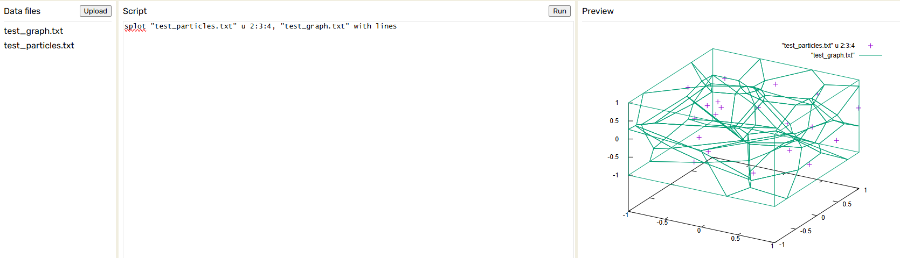
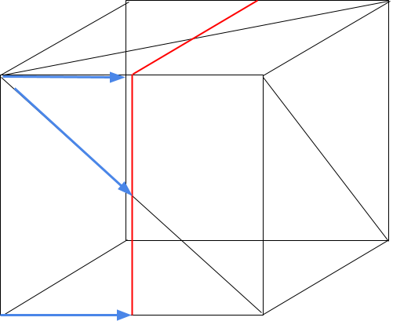
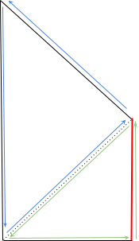
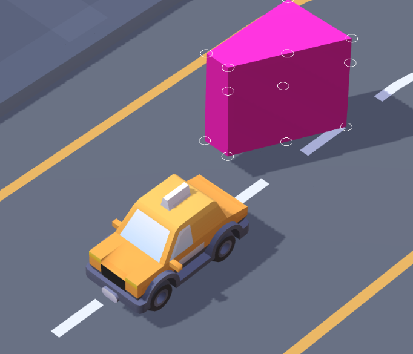

**Abstract**
-
For me, nothing brings a game more cohesion than a world that feels *tangible*. And ever since I decided to study game programming, my goal has been to learn new ways to re-create that feeling myself. It is to this end that I spent the last 8 weeks building a **Procedural Destruction System** for convex 3D meshes.

My goal with this blog post is to give a broad overview of how I went about destroying 3D meshes, and hopefully outline enough theory and show enough code that someone who reads this could give it a try themselves. 

**Introduction**
-
There are many different ways to go about destruction in videogames, and techniques range from prefabricating debris to deforming vertices in the GPU. For my project, I decided on procedurally creating new meshes at runtime from a 3D Voronoi diagram.

To *break down* what that means for the project, I'll basically need 3 key components.
1. **3D Voronoi Diagram Generation**
2. **Plane-Based Mesh Splitting**
3. **Debris Creation from the Modified Meshes**

New meshes, or the'debris', will ultimately be generated by taking the original mesh and repeatedly performing plane cuts to shape it into a piece of debris. The Voronoi Diagram will give me interesting shapes for the debris, and the process will be repeated for each cell in a diagram to destroy the mesh. Then I have to adapt all the relevant physics data to the debris, and the end result should be a convincing destruction.


Thankfully, I'm not starting this project with a completely blank slate. Since this project is an assignment for my study in Creative Media and Game Technologies at BUas, I'm able to use their proprietary engine to get a head start on all the boilerplate stuff, like Mesh Rendering, Physics, and an Entity Component System.


**Voronoi Diagram Generation**
- 
A Voronoi diagram is a pattern of cells generated from an assortment of points. The bounds of the cells are generated around each of the points based on the proximity of any one of the points to any other one, effectively creating edges along the bounds of equidistance between input points. The result is a collection of convex polygons of variable dimensions, and you can already see how this might lead to interesting shapes for debris.
<p align="center">
<image src="../assets/img/smolonoi.gif"></image>
</p>

[TomazTsql](https://tomaztsql.wordpress.com/2021/11/01/little-useless-useful-r-functions-interactive-voronoi-diagram-generator-using-r-and-x11/)

Adding an extra dimension to this diagram involves applying the same rules but to 3D points in a volumetric container. Of course, implementing this in code is nothing trivial, so I opted to use [Voro++](https://github.com/chr1shr/voro/tree/master), a C++ library for generating 3D voronoi diagrams. 



<small> 3D Voronoi Diagram made using Voro++ </small>

I generate the diagram once at the beginning of the program using the library's ```voro::container```. Then, for each face of each cell, I cache a single point on the face and its normal in a plane struct to feed into my mesh splitter later.

```cpp
 int i;
 double x, y, z;
 voro::container con(min_x, max_x, min_y, max_y, min_z, max_z, n_x, n_y, n_z, false, false, false, 8);

 for (i = 0; i < NUM_CELLS; i++)
 {
     x = min_x + (double(rand()) / RAND_MAX) * (max_x - min_x);
     y = min_y + (double(rand()) / RAND_MAX) * (max_y - min_y);
     z = min_z + (double(rand()) / RAND_MAX) * (max_z - min_z);
     con.put(i, x, y, z);
 }

 con.sum_cell_volumes();

 voro::c_loop_all cla(con); 
 voro::voronoicell cell;
 if (cla.start()) do 
         if (con.compute_cell(cell, cla))
         {               
             std::vector<glm::vec3>cell_face_offsets;
             
             //Get all vertices of the cell
             std::vector<double> vertices;
             cell.vertices(vertices);

             // Get face information - single vector version
             std::vector<int> face_vertices;
             cell.face_vertices(face_vertices);

             // Get face normals
             std::vector<double> face_normals;
             cell.normals(face_normals); 

             std::vector<ClipPlane> cell_planes;

             // Track our position in face_vertices
             int face_start = 0;
             for (int k = 0; k < cell.number_of_faces(); k++)
             {
                 // First number in each face entry is the number of vertices in that face
                 int face_size = face_vertices[face_start];

                 // Get a vertex on the face (using the first vertex of this face)
                 int vertex_index = face_vertices[face_start + 1] * 3;  // +1 to skip the size
                 double vertex[3] = {vertices[vertex_index], vertices[vertex_index + 1], vertices[vertex_index + 2]};

                 // Get the normal for this face
                 double normal[3] = {-face_normals[k * 3], -face_normals[k * 3 + 1], -face_normals[k * 3 + 2]};

                 cell_planes.push_back(ClipPlane(ToVec3(normal), ToVec3(vertex)));

                 // Move to next face
                 face_start += face_size + 1;  // +1 for the size value itself
             }
             cell_plane_bounds.push_back(cell_planes); 
         }
     while (cla.inc());
```

<small>(Fair warning to anyone seeking to do the same, Voro++ is kind of odd and most of the documentation is for a linux-based output program, so prioritize the Github documentation over their website since its more up to date.)</small>

**Mesh Splitter**
-
This was hands down the trickiest part of this project for me to accomplish. 

The splitter works on the basic principle of visible and non-visible elements of the mesh, and the ownership of ```Vertices``` by ```Edges``` by ```Faces```, so I created structs that can track this information in addition to what is typically expected from these variables. For a concrete example of the pseudocode for these structs and an overview of the splitting process, look to [this paper](https://www.geometrictools.com/Documentation/ClipMesh.pdf).

The star of the show is the ```Clipper``` class, which is responsible for making sense of all of these structs and outputting a complete mesh, cut along an input plane. The process for splitting a mesh is as follows:

In the clipper's constructor, I feed it the relevant mesh data (vertices, indices, normals) to process. The clipper then creates ```std::vectors``` of the appropriate Clip structs based off the mesh data to be used in the following step, which is clipping the mesh against the plane.

```cpp
int Clipper::ClipWithPlane(ClipPlane p) 
{ 
    switch (ProcessVertices(p))
    {
        case 1:
            return 1; // everything is included, use the original mesh
        case -1:
            return -1; // everything is cut, delete the mesh
    }
    ProcessEdges(p);
    ProcessFaces(p);
    return 0;
}
```
It returns an int as an early out, allowing the system that called it to continue without clipping anything if it isn't necessary, although that behaviour needs to be handled by the system that called it. The real magic happens in the 3 functions within the method. 
The first two are fairly straightforward, ```ProcessVertices()``` checks each vertex's signed distance to the plane and labels it ```visible``` if that distance is positive, and ```non-visible``` if it is negative. If all vertices are visible, ```return 1``` for early out, if all are not visible, ```return -1```. 
Assuming an early out is not taken, ```ProcessEdges()``` will, for each edge, once more find the signed distance of the vertices comprising it. Then, depending on the results it will do the following:

```cpp 
// signed distances
 float sd0 = plane.SignedDistance(vertices[e.v[0]].v);
 float sd1 = plane.SignedDistance(vertices[e.v[1]].v);
 
 if (sd0 <= 0 && sd1 <= 0)
     {...continue;} // cull edge, remove from faces sharing it and make non-visible
 
 if (sd0 >= 0 && sd1 >= 0) 
    continue; // edge is not clipped.

 if () (sd0 > sd1 || sd0 < sd1)
    { 
      /* create new vertex */
      /* new vertex = intersect of the edge with the plane */
      /* replace negative sd vertex with the new vertex */
    } 
    // keep visible point, replace non-visible point with intersect w/plane
 ```


```ProcessFaces()``` on the other hand, is pretty convoluted. It is important to know that I'm working with a renderer for triangulated meshes, so going forward a 'face' will be referring to a single triangle that the mesh is composed of, not the entire geometrical face. ```ProcessFaces()``` has multiple responsibilities. 

- Identify modified faces and verify that all edges are sequential (face is closed).
- For any open faces :
  - Append a new edge connecting the disconnected edges.
  - Add copy of appended edge to "plane face" which will cover the hole created by the plane clip.
  - For newly closed faces with 4 edges, split them into 2 faces of 3 edges. [ ] = [/]
- For the "plane face" :
  - Reorder appended edges counter clockwise to plane
  - Correct vertices for float imprecision
  - Triangulate the new face using CDT (Constrained Delauney Triangulation).

**Open Faces**

Any face not clipped in its entirety is still visible, and by the end of ```ProcessFaces()```, all faces still visible will make up the final mesh. To identify modified faces, I iterate through all the currently visible faces and test their edges to ensure each vertex appears *exactly twice*. I do not need to ensure all the edges are sequential in this case, since they are fresh from the mesh and have at most had edges removed or shortened, but not appended or reversed. And since faces are triangular, it is impossible to cut it in a way where more than one edge is completely removed without culling the face entirely, so that solves that issue too.

```cpp
bool Clipper::GetOpenPolyLine(ClipFace f, int& start, int& end) // assumes all edges are sequential
{
    if (f.f_edges.empty()) return false;

   // if a triangular face is complete, all vertices should occur twice
    for (auto fe : f.f_edges)
    {
        vertices[edges[fe].v[0]].occurs++;
        vertices[edges[fe].v[1]].occurs++;
    }
   start = -1; 
   end = -1;
   for (auto fe : f.f_edges)
   {
       int i0 = edges[fe].v[0], i1 = edges[fe].v[1];
       if (vertices[i0].occurs == 1)
           end = i0;
       if (vertices[i1].occurs == 1) 
           start = i1;
   }
   return start != -1; // true if open, false if closed
}
```


When finding an **open face**, I track the two vertices that the face began and ended with, which can be gleaned from the lone vertices' order in the edge they were included in (since, again, everything is still sequential)
```cpp
  int ..., start, end;
  if (GetOpenPolyLine(face, ..., start, end)) 
  {                
    // polyline is open, close it
    ClipEdge closer(start, end, face);
    uint16_t edge_idx = edges.size();
    edges.push_back(closer);
    //...
  }
```
After appending the freshly created edge to the face, I make sure to add a copy of the edge to the **'plane face'**, but with the order of the vertices reversed in order to maintain the same rotational sense on the adjacent face. By resolving all the open faces and adding their new edges to the 'plane face', I end up with a polygon that traces the outline of the hole left by the plane cut.


```cpp
    // add edge to new face (normals and vertices will need to change, so using the same edge is incovenient)
    ClipEdge dupe(closer); 
    uint16_t dupe_id = edges.size(); 

    // reverse order to maintain rotational sense on the adjacent face
    auto temp = dupe.v[0];
    dupe.v[0] = dupe.v[1];
    dupe.v[1] = temp; 
    
    // add edge to plane_face
    edges.push_back(dupe); 
    plane_face.f_edges.push_back(dupe_id); 
```

After appending, some faces will have exactly 3 edges, and I don't need to do any extra work to make them mesh ready. However, some of the faces will have **exactly 4 edges** instead, as a result of having one or more edges shortened but none removed entirely. The solution I came to was that, rather than congregating all of the polygons that make up one geometric face and triangulating that, I would perform a simple triangulation on each of these predictable quads. 



The 4-edged face is made non-visible, and two new faces are added to the mesh comprising of two of the 4 edges each and an additional edge appended connecting them, again placed in correct rotational sense relative to the other edges. Also, the faces take the same normal as the 4-edged one.

**Plane Face**

The result of this is an almost complete mesh, with the exception of the new geometric face created by the plane cut, which makes it look like there's a hole though it.


To fill this hole, I need to use the 'plane face', which is currently just a loose collection of a variable number of edges provided by the previous steps. The first priority is to remap these edges to new vertices in order to account for float imprecision in the previous steps. This ensures that the program doesn't return a false positive when it checks if the 'plane face' is open, on account of the vertices being different because of imprecision.

I used ```std::unordered_map```s for this step because I could tweak the custom **Hash** and **Equal** functions until I was satisfied with the level of precision of the approximation. To achieve a closed face at any level of precision, you could make tiny edges between each of the non-connecting vertices, but that results in more triangles, and small edges are the cause of serious stability issues for my system, as I will later discuss.

```cpp
    // Index each id to the same vertex
    std::unordered_map<uint16_t, glm::vec3> id_to_vert; 
    for (auto elem : close_face.f_edges)
    {
        id_to_vert[edges[elem].v[0]] = vertices[edges[elem].v[0]].v;
        id_to_vert[edges[elem].v[1]] = vertices[edges[elem].v[1]].v;
    }
     // Build reverse map, complete approximation (should be half the size of id_to_vert when done)
    std::unordered_map<glm::vec3, uint16_t, Vec3Hash, Vec3Equal> vert_to_id; 
    for (const auto& [x, y] : id_to_vert)
        vert_to_id[y] = x;
    
    // consolidate indices to avoid duplicates
    for (auto it = close_face.f_edges.begin(); it != close_face.f_edges.end();)
    {
        const auto& e = *it;
        edges[e].v[0] = vert_to_id[vertices[edges[e].v[0]].v];
        edges[e].v[1] = vert_to_id[vertices[edges[e].v[1]].v];
        if (edges[e].v[1] == edges[e].v[0])
            {/* throw an error because you made an ouroboros*/}
        else
            ++it;        
    }
```

Now that that is taken care of, I need to triangulate this new geometric face in order to get the triangles required for drawing the mesh. Since its not a simple shape like a quad, I opted to use [artem-ogre's CDT library](https://github.com/artem-ogre/CDT) to triangulate the polygon instead. Of course, CDT in this form is only applicable to 2D polygons, so I have to get a sequential list of all the 3D vertices and project them onto the plane before plugging them into the triangulation.

```cpp
    std::vector<glm::vec3> tobe2D;
    tobe2D.reserve(sequential_vertices.size());

    for (const auto vid : sequential_vertices)
        tobe2D.push_back(vertices[vid].v);

    // map to cdtverts
    std::unordered_map<uint16_t, uint16_t> index_key;   
    for (uint16_t i = 0; i <= sequential_vertices.size() - 1; i++)
    index_key[i] = sequential_vertices[i];

    // perform triangulation on the face
    std::vector<uint16_t> new_indices = TriangulateFace(plane.To2D(tobe2D, centroid));
```

I have a layer of culling where I remove collinear edges from the face to reduce triangles, but I cut it for (relative) brevity.

```cpp
std::vector<uint16_t> TriangulateFace(const std::vector<glm::vec2>& sequential_vertices)
{   
    if (sequential_vertices.size() < 3) return {};

    std::vector<CDT::V2d<float>> cdtverts;
    cdtverts.reserve(sequential_vertices.size());

    // OPTIONAL: add a layer of culling / removing colinear edges in order to reduce triangle output from CDT.

    for(int i = 0; i < sequential_vertices.size(); i++) 
        cdtverts.push_back(CDT::V2d<float>::make(sequential_vertices[i].x, sequential_vertices[i].y));

    // create edges + close loop
    std::vector<CDT::Edge> cdtedges;
    cdtedges.reserve(cdtverts.size());
    for (size_t i = 0; i < cdtverts.size() - 1; ++i)
        cdtedges.emplace_back(static_cast<CDT::VertInd>(i), static_cast<CDT::VertInd>(i + 1));
    if (!cdtverts.empty()) 
        cdtedges.emplace_back(static_cast<CDT::VertInd>(cdtverts.size() - 1), static_cast<CDT::VertInd>(0));

    CDT::Triangulation<float> cdt;
    cdt.insertVertices(cdtverts);
    cdt.insertEdges(cdtedges);
    cdt.eraseOuterTrianglesAndHoles();

    std::vector<uint16_t> face_indices;
    for (const auto& triangle : cdt.triangles)
    {
        face_indices.push_back(static_cast<uint16_t>(triangle.vertices[0]));
        face_indices.push_back(static_cast<uint16_t>(triangle.vertices[1]));
        face_indices.push_back(static_cast<uint16_t>(triangle.vertices[2]));
    }
    return face_indices;
}
```
All thats left is to add these triangles as ```ClipFace```s with the plane's normal to the mesh, and the hole is filled.



One last note on the splitter, the way you handle translating all the visible faces, edges, and vertices into a usable mesh is super case dependant. The renderer you use is the biggest factor here. But if your renderer, like mine, draws meshes from their central point, make sure you track the displacement from the original center to the new center somewhere so you can place your debris correctly in world space in the next step.

**Triggering Destruction and Making Debris**
-

Now that I had Plane Splitting working, functional destruction is just moments away.

The first step is to trigger the destruction from a point of contact with the object. To this end, I used the engine's [Jolt Physics](https://github.com/jrouwe/JoltPhysics) integration and used the contact point of a raycast against an AABB bounding box to trigger the shattering.

Since all the Jolt data is in world space, I also offset all the positional data and rotate both the plane's normal and the offset point of contact based on the mesh's rotation in order to convert the plane into local space for the mesh.

```cpp
std::vector<ClipPlane> chunk;
std::vector<ClipPlane> chunk2;

auto plane_n = glm::rotate(glm::inverse(t.GetRotation()), glm::normalize(flag.slicing_normal));
auto plane_n2 = glm::rotate(glm::inverse(t.GetRotation()), -glm::normalize(flag.slicing_normal));

chunk.push_back(
    ClipPlane(plane_n, glm::rotate(glm::inverse(t.GetRotation()), flag.point_of_contact - t.GetTranslation())));

chunk2.push_back(
    ClipPlane(plane_n2, glm::rotate(glm::inverse(t.GetRotation()), flag.point_of_contact - t.GetTranslation())));
```


Once I have all the planes I'll be clipping with for each chunk of debris, I can apply the cuts to a mesh and get the two pieces of debris corresponding to the plane. 

```cpp
bee::Entity bee::DestructionSystem::NewDebris(std::vector<ClipPlane> planes,
                                              glm::vec3 point_of_contact,
                                              float force,
                                              const MeshRenderer& meshRenderer,
                                              const Transform& t,
                                              uint32_t body_ID)
{
    // get the debris started
    auto ent = /* make a new ECS entity */
    auto& mr = /* make a new mesh renderer */
    auto mesh = /* make a new mesh */
    mr.Mesh = mesh;
    mr.Material = meshRenderer.Material;

    // center of new mesh in local space after split
    glm::vec3 new_center = glm::vec3(0);

    bool clipped_away = false;

    for (const auto& p : planes)
    {
        Clipper clippy(mr.Mesh);

        switch (clippy.ClipWithPlane(p))
        {
            case -1: // fully clipped away
                Engine.ECS().DeleteEntity(ent);
                clipped_away = true;
                return ent;
            case 1: // fully left alone
                break;
            case 0: // mesh splitting
                clippy.ConvertToMesh(mr.Mesh);
                new_center = clippy.new_center; 
                break;
        }
    }
    if (!clipped_away)
        MakePhysicsDebris(new_center, mr.Mesh->GetPositions(), body_ID, t, point_of_contact, force, ent); 

    return ent;
}
```

The final step is in that last little bit of code, which is to create a new physics body for the debris and to inherit the parent's physics properties. This is also pretty case dependant, but I found that feeding Jolt's ```ConvexHullShape``` the vertices of the mesh does a good job here. Just make sure to place the physics body correctly in world space based on the new center of the mesh. 

```cpp
  // Copy velocity and mass-related properties
 convex_body->SetLinearVelocity(bodyInterface.GetLinearVelocity(bid));
 convex_body->SetAngularVelocity(bodyInterface.GetAngularVelocity(bid));
  
 // REPLACE W/DATA ABOUT COLLISION
 if (force)
 {
      JPH::Vec3 shatter_dir =  physics::ToJolt(world_pos - poc); ;
      JPH::Vec3 shattering_force = force * shatter_dir.Normalized(); 

      bodyInterface.AddForce(convex_body->GetID(), shattering_force); 
 }
 ```
 <small> Also, using the parent's angular and linear velocities along with an additional force applied helps the effect look more believable </small>


When a voronoi-based destruction is triggered, the system attempts to create a piece of debris for each cell in the graph, aligning the graph to the point of contact with the object. The plane cuts are made using the normals of each face and a point on them, placed in local space for the mesh. 


Congrats! You have fruit ninja!

**Doing it with Voronoi**
-

In theory, this part is super easy. I already store all the planes I need to cut a shape by grouped up by voronoi cell. I'm able to make debris by cutting along a plane. And I can make physics bodies for the debris that fit any convex shape. What's the problem?

Well first, let's just break something. 


```cpp
for (auto planes : cell_plane_bounds)
{
    std::vector<ClipPlane> chunk;
    for (auto plane : planes)
    {
        glm::vec3 plane_n = glm::rotate(glm::inverse(t.GetRotation()), glm::normalize(plane.GetNormal()));
        glm::vec3 pos = glm::rotate(glm::inverse(t.GetRotation()), plane.GetPos());
        chunk.push_back(ClipPlane(plane_n, pos));
    }
    NewDebris(chunk, flag.point_of_contact, flag.destruction_force, mr, t, body.m_bodyID);
}
```


**The Problem:** 

A 3D Voronoi Diagram with only 10 points sounds like a simple task. And yet, to get there, you have to perform well over 100 plane cuts in one frame. The slowdown is also significantly worse for higher poly models, since each vertex still needs to be checked, and each intersected edge needs to be clipped. 

There's shouldn't be too much noticeable performance issues at low counts of debris, for example this video only uses 8 points, but as that number goes up, the slowdown is huge. There are also stability issues that arise with smaller edges and more triangles, as the plane cut can make incomplete faces due to float imprecision. 

**Conclusion & Plans for the Future**
-

I'll admit, this was a pretty ambitious project for the 8 Weeks I had to attempt it, and as a result I really didn't leave enough time for optimization. Given the chance, my priorities are definitely solving the stability issues and optimizing the code.

As far as optimization goes, some of it is my choices for certain data structures (```std::vectors``` *don't* actually solve everything), but there are large improvements that can be made algorithmically too. I highly reccomend [This Paper from NVIDIA](https://matthias-research.github.io/pages/publications/fractureSG2013.pdf) which speeds up this approach while also making it more robust *and* appicable to non-convex meshes. Its really cool, and I'm definitely gonna take a swing at it in the future. 

If you've got any questions (or tips!) please feel free to reach out to me through the details provided.