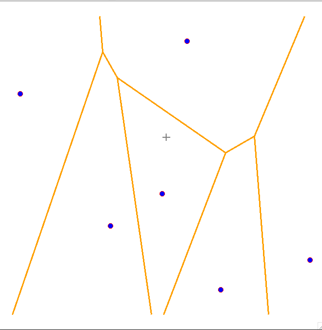

**Abstract**
-
For me, nothing brings a game more cohesion than a world that feels *tangible*. And ever since I decided to study game programming, my goal has been to learn new ways to re-create that feeling myself. It is to this end that I spent the last 8 weeks building a **Procedural Destruction System** for 3D meshes.

My goal with this blog post is to give a broad overview of how I went about destroying 3D meshes, and hopefully outline enough theory and show enough code that someone who reads this could give it a try themselves. 

**Introduction**
-
There are many different ways to go about destruction in videogames, and techniques range from prefabricating debris to deforming vertices in the GPU. For my project, I decided on procedurally creating new meshes at runtime from a 3D Voronoi diagram.

To *break down* what that means for the project, I'll basically need 3 key components.
1. 3D Voronoi Diagram Generation
2. Plane-Based Mesh Splitting
3. Debris Creation from the Modified Meshes

Thankfully, I'm not starting this project with a completely blank slate. Since this project is an assignment for my study in Creative Media and Game Technologies at BUas, I'm able to use their proprietary engine to get a head start on all the boilerplate stuff, like Mesh Rendering, Physics, and an Entity Component System.

**Voronoi Diagram Generation**
-
A Voronoi diagram is a pattern of cells generated from an assortment of points. The bounds of the cells are generated around each of the points based on the proximity of any one of the points to any other one, effectively creating edges along the bounds of equidistance between input points. The result is a collection of convex polygons of variable dimensions, and you can already see how this might lead to interesting shapes for debris.

[TomazTsql](https://tomaztsql.wordpress.com/2021/11/01/little-useless-useful-r-functions-interactive-voronoi-diagram-generator-using-r-and-x11/)

